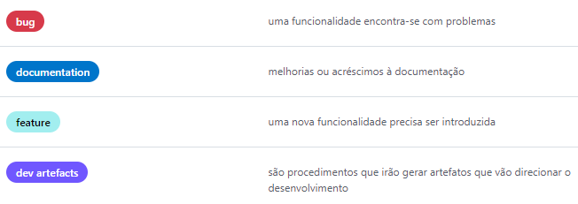
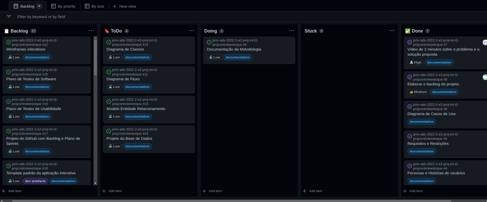

# Metodologia

Pré-requisitos: <a href="2-Especificação do Projeto.md"> Documentação de Especificação</a>

Descreva aqui a metodologia de trabalho do grupo para atacar o problema. Definições sobre os ambiente de trabalho utilizados pela  equipe para desenvolver o projeto. Abrange a relação de ambientes utilizados, a estrutura para gestão do código fonte, além da definição do processo e ferramenta através dos quais a equipe se organiza (Gestão de Times).

## Relação de Ambientes de Trabalho

Os artefatos do projeto são desenvolvidos a partir de diversas plataformas e a relação dos 
ambientes com seu respectivo propósito é apresentada na tabela que se segue.

|Ambiente                         |Plataforma e Link de Acesso                                                                                |
|---------------------------------|-----------------------------------------------------------------------------------------------------------|
|Repositório de código fonte      |[GitHub](https://github.com/ICEI-PUC-Minas-PMV-ADS/pmv-ads-2022-2-e2-proj-int-t2-projcontroleestoque)      |
|Documentos do projeto            |[GitHub](https://github.com/ICEI-PUC-Minas-PMV-ADS/pmv-ads-2022-2-e2-proj-int-t2-projcontroleestoque)      |
|Gerenciamento do Projeto         |[GitHub](https://github.com/orgs/ICEI-PUC-Minas-PMV-ADS/projects/68)                                       |
|Ferramentas UML                  |[Lucidchart](https://www.lucidchart.com/pages/pt)                                                          |

## Controle de Versão

Para controlar o processo de desenvolvimento do projeto, a ferramenta de controle de versão adotada foi o
[Git](https://git-scm.com/), sendo que o [Github](https://github.com)
foi utilizado para hospedagem do repositório.

O projeto segue a seguinte convenção para o nome de branches:

- `main`: versão estável já testada do software
- `testing`: versão em testes do software
- `feature`: versão de desenvolvimento de um recurso do software.

Quanto à gerência de issues, o projeto adota a seguinte convenção para
etiquetas:

Discuta como a configuração do projeto foi feita na ferramenta de versionamento escolhida. Exponha como a gerência de tags, merges, commits e branchs é realizada. Discuta como a gerência de issues foi realizada.

> **Links Úteis**:
> - [Tutorial GitHub](https://guides.github.com/activities/hello-world/)
> - [Git e Github](https://www.youtube.com/playlist?list=PLHz_AreHm4dm7ZULPAmadvNhH6vk9oNZA)
>  - [Comparando fluxos de trabalho](https://www.atlassian.com/br/git/tutorials/comparing-workflows)
> - [Understanding the GitHub flow](https://guides.github.com/introduction/flow/)
> - [The gitflow workflow - in less than 5 mins](https://www.youtube.com/watch?v=1SXpE08hvGs)

## Gerenciamento de Projeto

### Divisão de Papéis

A equipe utiliza metodologia ágil baseada em scrum para definição e organização do processo de desenvolvimento do software. Distribuída da seguinte forma:

- Scrum Master: Igor Morais 
- Product Owner: Vitor Gomes 
- Equipe de Desenvolvimento: Igor Morais, Vitor Gomes, Henrique Gomes, Giovanna Coura, Gabriel Xavier, Rafael Gonçalves.

### Processo

A ferramenta escolhida para gerênciamento ágil de tarefas foi o Github Projects. 
Com seguintes colunas:

Backlog: tarefas mapeadas, porém não priorizadas na sprint; 
ToDo: tarefas a serem trabalhadas na sprint atual, mas não iniciadas; 
Doing: tarefas em andamento; 
Stuck: tarefas com algum impedimento/bloqueio; 
Done: tarefas concluídas. 

 

### Ferramentas

As ferramentas empregadas no projeto são:

 Ferramenta | Função | Escolha                 |
| -------------------- | ---------------------------------- | -------------------------------------- |
| Visual Studio Code | Editor de código | facilidade de uso e padronização. |
| Teams, Whatsapp e Github        | Ferramentas de Comunicação                 | Contato com orientado e realização de cerimônias, rapidez na comunicação dia-a-dia e visualização de atividades de colegas de equipe.  |
| Figma   |    Feramenta de wireframe | Facilidade em compartilhar atividade |