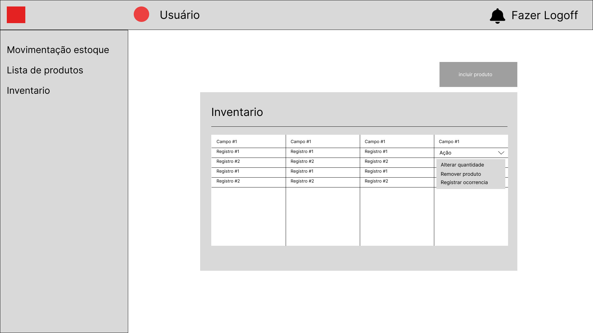

# Projeto de Interface

Pré-requisitos: <a href="2-Especificação do Projeto.md"> Documentação de Especificação</a>

Visão geral da interação do usuário pelas telas do sistema e protótipo interativo das telas com as funcionalidades que fazem parte do sistema (wireframes).

 Apresente as principais interfaces da plataforma. Discuta como ela foi elaborada de forma a atender os requisitos funcionais, não funcionais e histórias de usuário abordados nas <a href="2-Especificação do Projeto.md"> Documentação de Especificação</a>.

## Diagrama de Fluxo

O diagrama apresenta o estudo do fluxo de interação do usuário com o sistema interativo e  muitas vezes sem a necessidade do desenho do design das telas da interface. Isso permite que o design das interações seja bem planejado e gere impacto na qualidade no design do wireframe interativo que será desenvolvido logo em seguida.

O diagrama de fluxo pode ser desenvolvido com “boxes” que possuem internamente a indicação dos principais elementos de interface - tais como menus e acessos - e funcionalidades, tais como editar, pesquisar, filtrar, configurar - e a conexão entre esses boxes a partir do processo de interação. Você pode ver mais explicações e exemplos https://www.lucidchart.com/blog/how-to-make-a-user-flow-diagram.

As referências abaixo irão auxiliá-lo na geração do artefato “Diagramas de Fluxo”.

> **Links Úteis**:
> - [Fluxograma online: seis sites para fazer gráfico sem instalar nada | Produtividade | TechTudo](https://www.techtudo.com.br/listas/2019/03/fluxograma-online-seis-sites-para-fazer-grafico-sem-instalar-nada.ghtml)

## Wireframes

As telas do sistema apresentam uma estrutura comum que é apresentada na Figura X. Nesta estrutura, existem 3 grandes blocos, 
descritos a seguir. São eles:

- `Barra de navegação de topo`:  local onde estão dispostos todos as funcionalidades ligadas ao usuário;
- `Barra de navegação esquerda`: local onde estão dispostos todos os elementos que auxiliam na navegação pelo site;
- `Conteúdo`: apresenta o conteúdo da tela em questão.

### Tela - Login

<table><tr><td></td></tr></table>

### Tela - Movimentação de estoque

<table><tr><td></td></tr></table>

### Tela - Notificações

<table><tr><td></td></tr></table>

### Tela - Lista de produtos

<table><tr><td></td></tr></table>

### Tela - Incluir produto

<table><tr><td></td></tr></table>

### Tela - Alterar produto

<table><tr><td></td></tr></table>

### Tela - Excluir produto

<table><tr><td></td></tr></table>

### Tela - Inventario

<table><tr><td></td></tr></table>

### Tela - Inventario alterar quantidade

<table><tr><td></td></tr></table>

### Tela - Inventario(Controle)

<table><tr><td></td></tr></table>

### Tela - Agendar inventario(Controle)

<table><tr><td></td></tr></table>

### Tela - Fornecedor(Controle)

<table><tr><td></td></tr></table>

### Tela - Detalhes fornecedor(Controle)

<table><tr><td></td></tr></table>

### Tela - Cadastrar produto do fornecedor(Controle)

<table><tr><td></td></tr></table>

### Tela - Reposição de estoque(Controle)

<table><tr><td></td></tr></table>

### Tela - Cadastrar reposição de estoque(Controle)

<table><tr><td></td></tr></table>

### Tela - Cadastrar reposição de estoque(Controle)

<table><tr><td></td></tr></table>

### Tela - Editar reposição de estoque(Controle)

<table><tr><td></td></tr></table>

### Tela - Relatorio

<table><tr><td></td></tr></table>

### Tela - Reposição de estoque(Gerencia Controle)

<table><tr><td></td></tr></table>

### Tela - Reposição de estoque avaliação(Gerencia Controle)

<table><tr><td></td></tr></table>

### Tela - Reposição de estoque(Financeiro)

<table><tr><td></td></tr></table>

### Tela - Reposição de estoque avaliação(Financeiro)

<table><tr><td></td></tr></table>

### Tela - Pagamento(Financeiro)

<table><tr><td></td></tr></table>

### Tela - Parcelamento(Financeiro)

<table><tr><td></td></tr></table>
